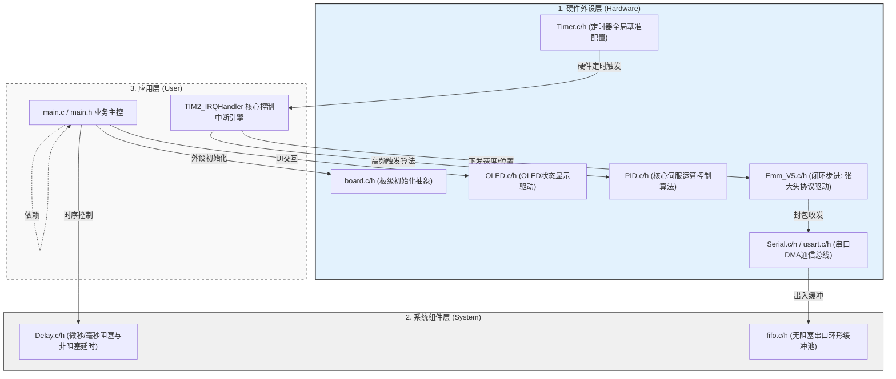
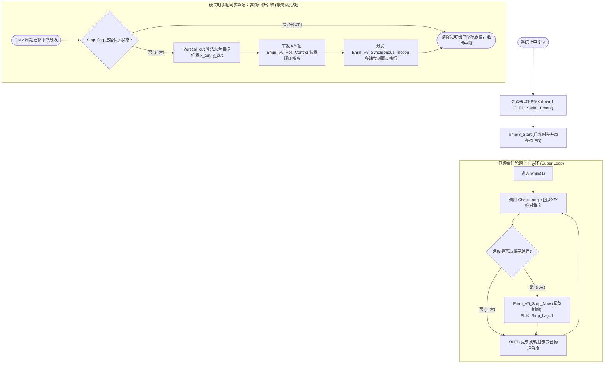

# 闭环云台系统固件架构设计 (Tripod Head)

本项目采用了规范的单片机分层架构。通过图文结合的方式，快速厘清模块职责及核心控制流向。

---

## 一、 系统分层架构 (Architecture)

整个工程由下至上严格解耦为 **硬件外设层**、**系统组件层** 和 **应用层**，确保低耦合、高内聚。

---

## 二、 核心控制流可视 (Core Control Flow)

固件的大脑集中在 `User/main.c`。程序运行时主要分为 **主循环 (Super Loop)** 和 **高频定时器中断引擎** 两条线并发推进。

---

## 三、 核心模块职责目录 (Module Dictionary)

### 3.1 应用层 (User)

- **`main.c/h`**：业务机入口。负责组件上电初始化、主循环任务流转调度、电机越限软保护判定（阈值比较），连接上下层模块逻辑。

### 3.2 系统组件层 (System)

- **`Delay.c/h`**：提供高精度的系统时间服务（特别是微秒级别），是满足外设通讯协议时序要求的保障。
- **`fifo.c/h`**：基于 Ring Buffer 环形队列思想封装。专门应对串口高频数据交互，有效防范连续指令堆叠时的数据重写与粘包丢失。

### 3.3 硬件外设层 (Hardware)

- **`board.c/h`**：板级抽象层，隔离底层硬件引脚与上层应用逻辑耦合，便于后期快速移植。
- **`PID.c/h`**：针对本云台应用深度优化的位置、速度闭环数学运算控制枢纽。
- **`Emm_V5.c/h`**：**张大头 5.0 闭环步进**指令驱动库。囊括停机、多轴同步控制与高效位置调控的 API 封装。
- **`OLED.c/h` & `OLED_Data.c/h`**：I2C/SPI 图形显示协议与绘制驱动，作为系统运行状态和传感数据的反馈窗口。
- **`Timer.c/h`**：系统心跳及硬实时控制基石。重构了 TIM2 等中断资源调度方案，主要用于支撑高精算法调度需求。
- **`Serial.c/h` & `usart.c/h`**：UART 数据链路设施层。依托中断/ DMA，非阻塞地完成底层收发任务并交付给数据缓冲区。
